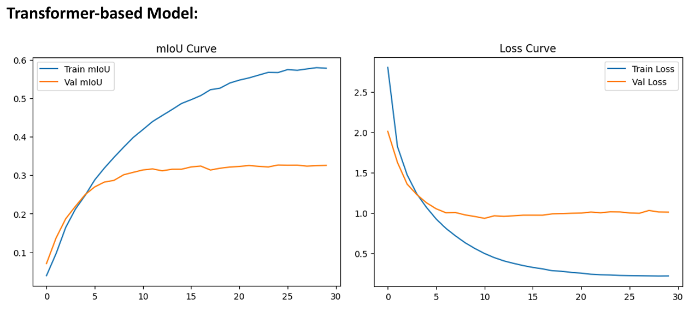
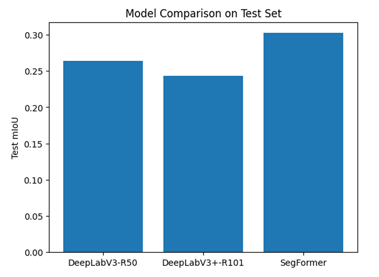
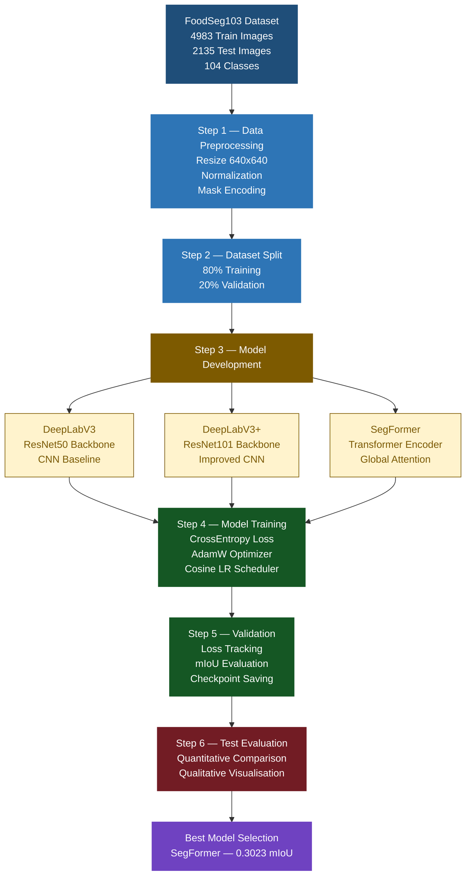
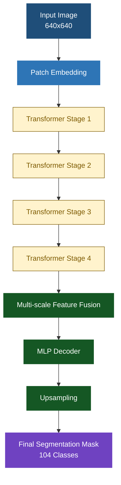

# Multi-Class Food Image Segmentation using CNNs and Transformers
### End-to-End Semantic Segmentation Pipeline using Deep Learning & Vision Transformers

[](https://python.org)
[](https://pytorch.org)
[](https://huggingface.co)
[](https://opencv.org)

---

## Overview

This project implements and compares multiple semantic segmentation architectures on the **FoodSeg103** dataset for pixel-level food image understanding.

The objective is to classify every pixel in a food image into one of **104 semantic classes**, enabling accurate segmentation of complex multi-object food scenes.

The project explores both:

- **CNN-based segmentation architectures**
- **Transformer-based segmentation architectures**

and evaluates their performance using **Mean Intersection over Union (mIoU)**.

---

## Results

| Model | Architecture Type | Test mIoU |
|---|---|---|
| DeepLabV3 (ResNet50) | CNN | 0.2636 |
| DeepLabV3+ (ResNet101) | CNN | 0.2432 |
| **SegFormer** | **Transformer** | **0.3023** |

> SegFormer achieved the best performance with **0.3023 mIoU**, outperforming CNN-based models through transformer-based global attention.

---

## Demo

### DeepLabV3(ResNet50)
.png)

### DeepLabV3+(ResNet101)
.png)

### SegFormer


### Models Comparison


---

## Pipeline



---

## Model Architectures

### 1. DeepLabV3 — CNN Baseline

- ResNet50 encoder backbone
- Atrous Spatial Pyramid Pooling (ASPP)
- Multi-scale contextual feature extraction
- Strong baseline for semantic segmentation

---

### 2. DeepLabV3+ — Improved CNN

- ResNet101 backbone
- ASPP module
- Decoder for sharper segmentation boundaries
- Enhanced feature representation capacity

---

### 3. SegFormer — Transformer-Based Model

- MiT Transformer Encoder
- Multi-scale feature extraction
- Lightweight MLP decoder
- Global self-attention mechanism
- Best-performing architecture in this project

---

## SegFormer Architecture



---

## Key Technical Highlights

- Implemented multi-class semantic segmentation across **104 food categories**
- Compared **CNN-based** and **Transformer-based** architectures
- Developed complete PyTorch training & evaluation pipeline
- Used **CrossEntropy Loss**, **AdamW**, and **Cosine Annealing Scheduler**
- Applied transformer-based segmentation using **SegFormer**
- Achieved **0.3023 test mIoU**
- Built qualitative visualisation pipeline for prediction analysis
- Automated checkpoint saving and best model selection

---

## Evaluation Metrics

### CrossEntropy Loss
Used during training to optimise pixel-wise class prediction.

### Mean Intersection over Union (mIoU)
Primary evaluation metric for segmentation quality.

```text
IoU = Intersection / Union
mIoU = Mean IoU across all classes
```

mIoU was preferred over accuracy because it handles class imbalance more effectively.

---

## Training Configuration

| Parameter | Value |
|---|---|
| Image Resolution | 640 × 640 |
| Batch Size | 16 |
| Optimizer | AdamW |
| Scheduler | Cosine Annealing |
| Loss Function | CrossEntropyLoss |
| Evaluation Metric | mIoU |
| GPU | NVIDIA A100 |

---

## Tech Stack

| Category | Tools |
|---|---|
| Deep Learning | PyTorch |
| Transformers | Hugging Face Transformers |
| Computer Vision | OpenCV |
| Data Processing | NumPy, Pandas |
| Visualisation | Matplotlib |
| Environment | Google Colab |
| Hardware | NVIDIA A100 GPU |

---

## Project Structure

```text
food-image-segmentation/
│
├── README.md
│
├── src/
│   └── Food_Image_Segmentation.ipynb
│
├── results/
│   ├── DeeplabV3(ResNet50.png)
│   ├── DeeplabV3+(ResNet101.png)
│   ├── SegFormer.png
│   ├── Model_Comparison.png
│
└── data/
    └── README.md
```

---

## Installation

```bash
git clone https://github.com/YOUR_USERNAME/food-image-segmentation.git

cd food-image-segmentation

pip install -r requirements.txt
```

---

## Dataset

This project uses the **FoodSeg103** dataset.

Dataset Link:
https://xiongweiwu.github.io/foodseg103.html

Due to dataset size and licensing considerations, raw dataset files are not included in this repository.

After downloading, place the dataset inside:

```text
data/FoodSeg103/
```

---

## Running the Project

Open the notebook inside:

```text
src/food_segmentation.ipynb
```

Train and evaluate models directly in Google Colab or Jupyter Notebook.

---

## Future Improvements

Potential future enhancements include:

- Advanced augmentation strategies
- Mixed precision training
- Larger SegFormer variants
- Class-balanced loss functions
- Real-time inference optimisation
- Per-class IoU analysis

---

## References

```bibtex
@article{wu2021foodseg103,
  title={A Large-Scale Benchmark for Food Image Segmentation},
  author={Wu, Xiongwei and others},
  journal={arXiv preprint arXiv:2105.05409},
  year={2021}
}

@inproceedings{xie2021segformer,
  title={SegFormer: Simple and Efficient Design for Semantic Segmentation with Transformers},
  author={Xie, Enze and others},
  booktitle={NeurIPS},
  year={2021}
}

@article{chen2017deeplab,
  title={DeepLab: Semantic Image Segmentation with Deep Convolutional Nets},
  author={Chen, Liang-Chieh and others},
  journal={TPAMI},
  year={2017}
}
```

---

## Author

**AJ**

MSc Computer Science / Artificial Intelligence  
Semantic Segmentation using CNNs and Vision Transformers
